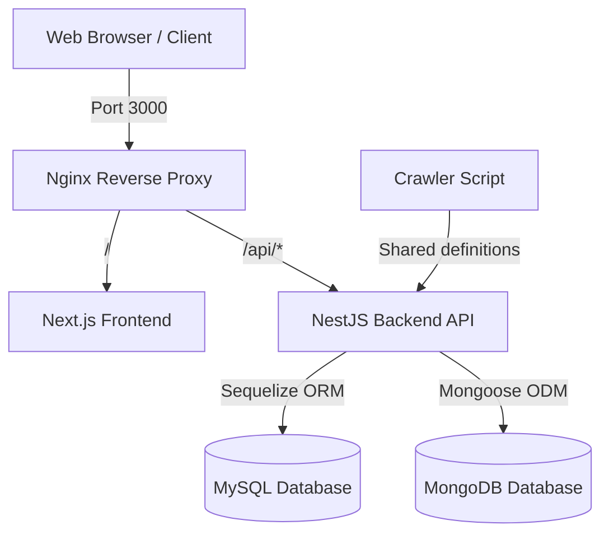

# PC-Builder Project Structure & Architecture

This document provides an overview of the monorepo architecture, workspace structure, databases, and individual services/packages in the **PC-Builder** application.

---

## System Architecture

The application is built using a modern, containerized monorepo stack. The entry point of all traffic is handled by Nginx, which routes requests appropriately to either the Next.js frontend or NestJS backend API.



---

## Monorepo Workspaces

The project uses **npm workspaces** to manage multiple packages and applications within a single repository. The workspace configuration is defined in the root [package.json](./package.json):

```json
"workspaces": [
  "apps/*",
  "packages/*"
]
```

### Directory Overview

- **`apps/`**: Self-contained applications (e.g., frontend, backend, crawler).
- **`packages/`**: Shared libraries, components, types, and logic reused across multiple apps.
- **`docker/`**: Service-specific Docker configurations (Compose files, Dockerfiles, local health checks).

---

## Detailed Directory Map

### 1. Applications (`apps/`)

#### 💻 Frontend App — `apps/frontend/`

A Next.js (v15+) application using React 19, TailwindCSS, and Next.js App Router.

- **[package.json](./apps/frontend/package.json)**: Frontend dependencies, scripts, and dev tools (includes `@pc-builder/shared`).
- **[next.config.js](./apps/frontend/next.config.js)**: Configures Next.js compilation, dev proxy, and image remote patterns.
- **`apps/frontend/src/app/`**: Next.js App Router pages and API routes:
  - `apps/frontend/src/app/[topic]/`: Topic-based routing.
  - `apps/frontend/src/app/article/`: Notion-style article viewing and editing.
  - `apps/frontend/src/app/build/`: Interactive PC builder with validation.
  - `apps/frontend/src/app/part/`: Parts catalog, specs, and filters.
- **`apps/frontend/src/`**: Shared frontend resources:
  - `components/`: Low-level and reusable layout/UI components (e.g., modals, form fields, navigation).
  - `features/`: Domain-specific components grouped by module:
    - `article/`: Article rendering, custom rich text editors, and preview cards.
    - `auth/`: Authentication UI and forms.
    - `build/`: Build list, builder dashboard, compatibility issues.
    - `part/`: Parts list, specifications tables, comparison grids.
  - `hooks/`: Reusable React Hooks.
  - `utils/`: API clients (using Axios) and helper utilities.

#### ⚙️ Backend App — `apps/backend/`

A NestJS (v11+) application providing a RESTful JSON API.

- **[package.json](./apps/backend/package.json)**: NestJS microservices, database connectors, and security tools.
- **`apps/backend/src/`**: NestJS modules, controllers, and services (business logic layer):
  - [app.module.ts](./apps/backend/src/app.module.ts): Application root module configuring global filters, guards, and DB connections.
  - `article/`: Mongoose-powered endpoints for managing rich guides/articles.
  - `auth/`: JWT authentication endpoints, hashing, and token issuing.
  - `build/`: Logic for creating and validating PC builds (evaluates rules for component compatibility).
  - `part/`: Endpoints for parts catalog query, sorting, and details.
  - `user/`: User profile management.
  - `utils/`: NestJS guards (e.g., [role.guard.ts](./apps/backend/src/utils/role/role.guard.ts)), middlewares (e.g., [session.middleware.ts](./apps/backend/src/utils/session.middleware.ts)), and pipes.
- **`apps/backend/models/`**: Sequelize MySQL entities, connection configuration, and database schemas:
  - [Connection.ts](./apps/backend/models/Connection.ts): Database connector instance configuring Sequelize with MySQL dialect parameters.
  - `parts/`: Tables representing specifications of CPU, GPU, RAM, Motherboard, Storage, Case, Power Supply, and Cooler.
  - `sellers/`: Maps component listings to external retailers and crawled pricing.
  - `user/`: User database model definition.
  - > [!NOTE]
  - > Articles are stored in MongoDB and managed by the Mongoose schema defined under [Article.entity.ts](./apps/backend/src/article/entities/Article.entity.ts).

#### 🕷️ Crawler — `apps/crawler/`

A TypeScript script designed to scrape and update parts catalog information.

- **[crawler.ts](./apps/crawler/crawler.ts)**: Fetches computer components and saves them into the database using shared schemas.
- **[package.json](./apps/crawler/package.json)**: Scripts and CLI tool packages (uses `ts-node`).

---

### 2. Packages (`packages/`)

#### 📦 Shared Library — `packages/shared/`

Contains common validation schemas (Zod), interfaces, constants, and utilities shared between Frontend, Backend, and Crawler.

- **[package.json](./packages/shared/package.json)**: Configured as a local dependency package `@pc-builder/shared`.
- **`packages/shared/article/`**: Article schema validation, state enums (Draft/Published), content structure types.
- **`packages/shared/build/`**: Compatibility rule checkers, connectors validation, power estimation, physical clearance rules.
- **`packages/shared/interface/`**: Specifications and hardware layouts (Case form factors, external ports, socket dimensions).
- **`packages/shared/part/`**: Types and product category definitions.
- **`packages/shared/retailer/`**: Seller structures and pricing interfaces.
- **`packages/shared/user/`**: Types and verification fields for users.

---

### 3. Docker Infrastructure (`docker/`)

- **[compose.yaml](./compose.yaml)**: Root docker-compose configuration. Includes individual docker service specifications.
- **`docker/database/`**: Sets up [mysql:9.5](./docker/database/compose.yaml#L2) and custom MongoDB service, including container health checks.
- **`docker/nestjs/`**: Contains the Backend Dockerfile and environment configuration for dev/prod profiles.
- **`docker/nextjs/`**: Contains the Frontend Dockerfile supporting Next.js standalone server mode.
- **`docker/nginx/`**: Nginx Docker configuration mapping `/` to frontend and `/api` to backend.

---

## Environment Configuration

- **[.env.example](./.env.example)**: Reference environment variables for database configurations, secrets, and JWT tokens. Copy this file to `.env` before running development.

---

## Monorepo Run Commands

Use these commands from the root directory to manage the workspace:

- **Install dependencies**:
  ```bash
  npm run install:all
  ```
- **Run Frontend in Dev mode**:
  ```bash
  npm run dev:frontend
  ```
- **Run Backend in Dev mode**:
  ```bash
  npm run dev:backend
  ```
- **Build the Shared package**:
  ```bash
  npm run build:shared
  ```
- **Trigger parts crawling**:
  ```bash
  npm run crawl
  ```
